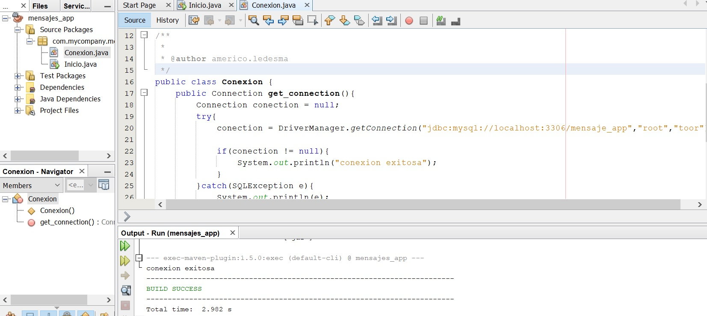
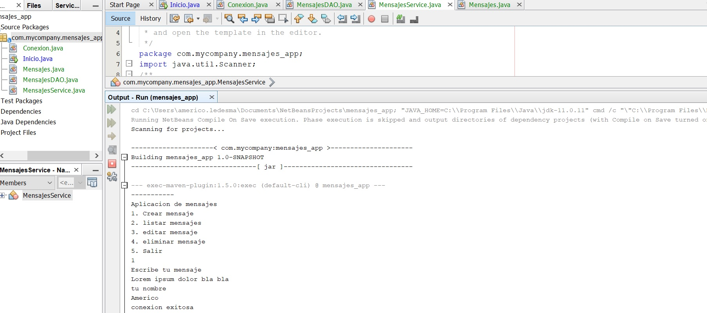
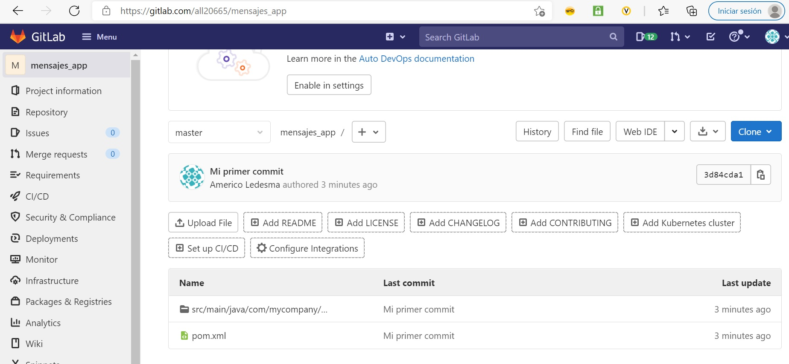

# Java SE Persisting Data Course

##### Table of contents
* [Introduction](#introduction) 
* [Technologies](#technologies)
* [Commands](#commands)
* [Syntax](#syntax)
* [Illustrations](#illustrations)

## Introduction
We learn about the CRUD(Create, Read, Update, Delete) in databases and files.
REST APIs enable you to develop any kind of web application having all possible CRUD operations.

****************************************************

## Technologies
* NetBeans IDE 12.0
* Java 11

****************************************************

## Commands:

| HTTP Method | Description                    |
| ------------- | ------------------------------ |
| `POST`      | Create.       |
| `GET`   |  Read.    | 
| `PUT`   | Update/Replace.    | 
| `PATCH`   |  	Partial Update/Modify.     | 
| `DELETE`   |  Delete.     | 

****************************************************

## Syntax
#### Read example
```java
public static void leerMensajesDB(){
        Conexion db_connect = new Conexion();
        
        PreparedStatement ps=null;
        ResultSet rs=null;
        
        try(Connection conexion = db_connect.get_connection())  {        
            String query="SELECT * FROM mensajes";
            ps=conexion.prepareStatement(query);
            rs=ps.executeQuery();
            
            while(rs.next()){
                System.out.println("ID: "+rs.getInt("id_mensaje"));
                System.out.println("Mensaje: "+rs.getString("mensaje"));
                System.out.println("Autor: "+rs.getString("autor_mensaje"));
                System.out.println("Fecha: "+rs.getString("fecha_mensaje"));
                System.out.println("");
            }
        }catch(SQLException e){
            System.out.println("no se pudieron recuperar los mensajes");
            System.out.println(e);
        }
    }
```

****************************************************


## Illustrations
##### Connection success (First Practice)


****************************************************

##### CRUD Practice
(Create, Read, Update, Delete)


****************************************************

##### GitLab Test


